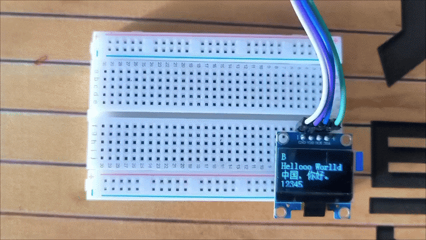
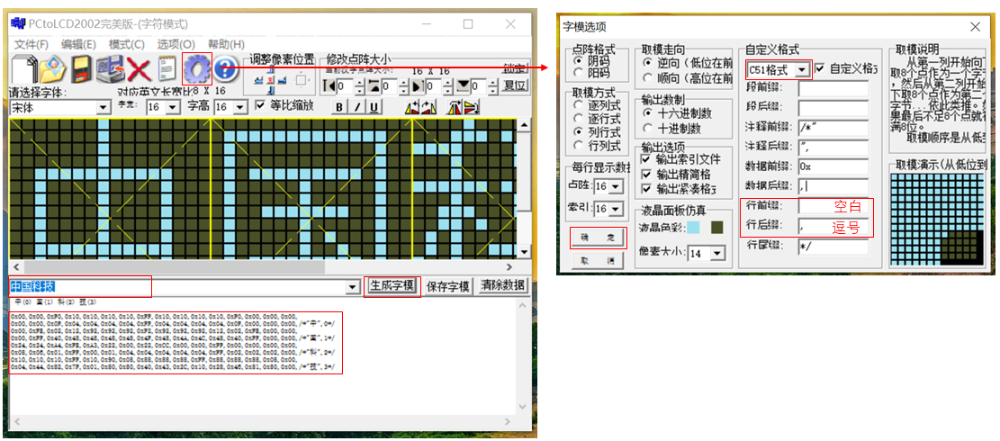

# ESP32-C3 OLED 显示屏驱动

本项目是基于**江协科技 STM32 OLED 显示屏驱动**移植而来的 ESP32-C3 OLED 显示屏驱动库，适用于 128x64 分辨率的 OLED 屏幕（I2C 接口）。本驱动库专为 ESP32-C3 开发板设计，支持 Arduino、 PlatformIO 开发环境。

## 项目简介

本驱动库基于江协科技的 STM32 OLED 驱动代码移植而来，适配 ESP32-C3 的硬件 I2C 控制器，并针对 ESP-IDF 开发环境进行了优化。支持显示 ASCII 字符、汉字、图形等内容，适用于各种需要 OLED 显示屏的 ESP32-C3 项目。

适配  ESP32系列 开发板

原视频链接：
江协科技 STM32 0.96寸OLED显示屏

https://www.bilibili.com/video/BV1EN41177Pc?vd_source=a30fc83aeeb8860c9b86b190dd6d1b82

### 特性

- **支持多种显示内容**：
  - ASCII 字符（8x16 和 6x8 两种字体）
  - 汉字（16x16 点阵）
  - 图形（支持任意尺寸的图像显示）
  - 基本图形绘制（点、线、矩形、圆、椭圆等）
- **易用性**：提供简洁的 API 接口，方便快速集成到项目中。
- **可移植性**：代码结构清晰，易于移植到其他 ESP32 系列开发板。
- **开源免费**：基于 MIT 许可证开源，允许自由使用和修改。

## 硬件要求

- **开发板**：ESP32-C3
- **OLED 屏幕**：128x64 分辨率，I2C 接口
- **接线**：
  - SCL -> GPIO 5
  - SDA -> GPIO 4
  - VCC -> 3.3V
  - GND -> GND

## 开发环境

- **操作系统**：Windows 1O
- **开发框架**：Arduino、 PlatformIO

## 快速开始

### 项目说明：

**OLED.cpp**：OLED相关的函数的具体实现

**OLED.h**:  定义OLED相关的函数声明，如OLED初始化，显示(文字、数字等)、绘图……

**OLED_Data.cpp**：OLED 相关数据的具体实现，如要增加汉字数据，可以在这里添加

**OLED_Data.h**：定义OLED  相关数据的声明，如ASCII字模、汉字、图像等数据

**main.cpp**： ESP32-C3 测试OLED屏幕文件，适用于 PlatformIO 平台 

**test.ino**：ESP32-C3 测试OLED屏幕文件，适用于 Arduino 平台 

**取模软件-PCtoLCD2002**：主要用于汉字、图片字模数据的生成


### 1. 克隆项目

```bash
git clone https://github.com/LKjoey/esp32-oled-show.git
```

### 2. 配置目标

确保已配置好 Arduino或者PlatformIO 开发环境，可以按照以下方式进行使用：

**Arduino** 平台

将 **test.ino、OLED.cpp、OLED.h、OLED_Data.cpp、OLED_Data.h**  放置在同一个文件

**PlatformIO** 平台

将 **main.cpp、OLED.cpp、OLED_Data.cpp** 放置在项目 **src** 文件夹内

将 **OLED.h、OLED_Data.h **放置在项目 **include**文件夹内

### 3. 修改引脚 
在 **OLED.cpp** 中，检查以下配置：
- **I2C 引脚配置**：确保 SCL 和 SDA 引脚与硬件接线一致（默认 SCL=5，SDA=4）。
```c
#define SCL_PIN          5
#define SDA_PIN          4
```

### 4. 编译烧录

编译烧录完成之后，出现以下现象表示成功，OLED屏幕上出现四行不同的字符，2s后清除屏幕字符，然后继续显示



### 5. 增加中文数据

打开取模软件PCtoLCD2002.exe，先设置字模格式，然后在输入框中输入汉字，就可以生成字模数据了，将字模数据复制到OLED_Data.cpp中的汉字部分，如代码382行，按照上面的汉字格式进行添加，保持队形



## API 参考

### 初始化

- `void OLED_Init(void)`：初始化 OLED 屏幕。

### 显示控制

- `void OLED_Clear(void)`：清空屏幕。
- `void OLED_Update(void)`：将显存内容更新到屏幕。
- `void OLED_ShowChar(int16_t X, int16_t Y, char Char, uint8_t FontSize)`：显示单个字符。
- `void OLED_ShowString(int16_t X, int16_t Y, char *String, uint8_t FontSize)`：显示字符串。
- `void OLED_ShowChinese(int16_t X, int16_t Y, char *Chinese)`：显示汉字。
- `void OLED_ShowImage(int16_t X, int16_t Y, uint8_t Width, uint8_t Height, const uint8_t *Image)`：显示图像。

### 图形绘制

- `void OLED_DrawPoint(int16_t X, int16_t Y)`：绘制点。
- `void OLED_DrawLine(int16_t X0, int16_t Y0, int16_t X1, int16_t Y1)`：绘制直线。
- `void OLED_DrawRectangle(int16_t X, int16_t Y, uint8_t Width, uint8_t Height, uint8_t IsFilled)`：绘制矩形。
- `void OLED_DrawCircle(int16_t X, int16_t Y, uint8_t Radius, uint8_t IsFilled)`：绘制圆形。
- `void OLED_DrawEllipse(int16_t X, int16_t Y, uint8_t A, uint8_t B, uint8_t IsFilled)`：绘制椭圆。

## 许可证

本项目基于 MIT 许可证开源。详细信息请参阅 [LICENSE](LICENSE) 文件。

## 致谢

- 本驱动基于江协科技的 STM32 OLED 显示屏驱动移植而来，感谢江协科技的开源贡献。

## 反馈与贡献

如果您在使用过程中遇到问题或有改进建议，欢迎提交 Issue 或 Pull Request。您的支持是项目发展的动力！
